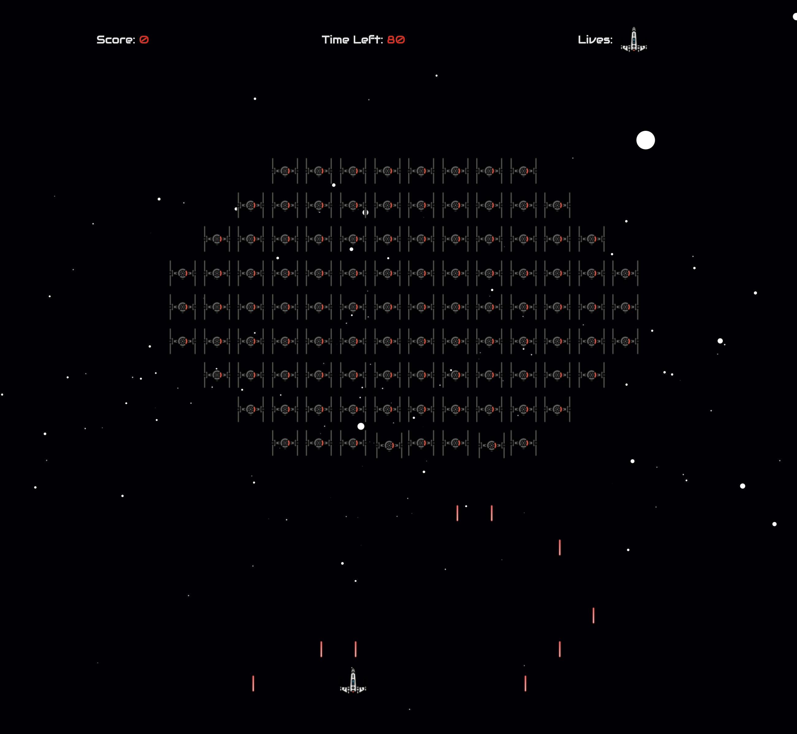
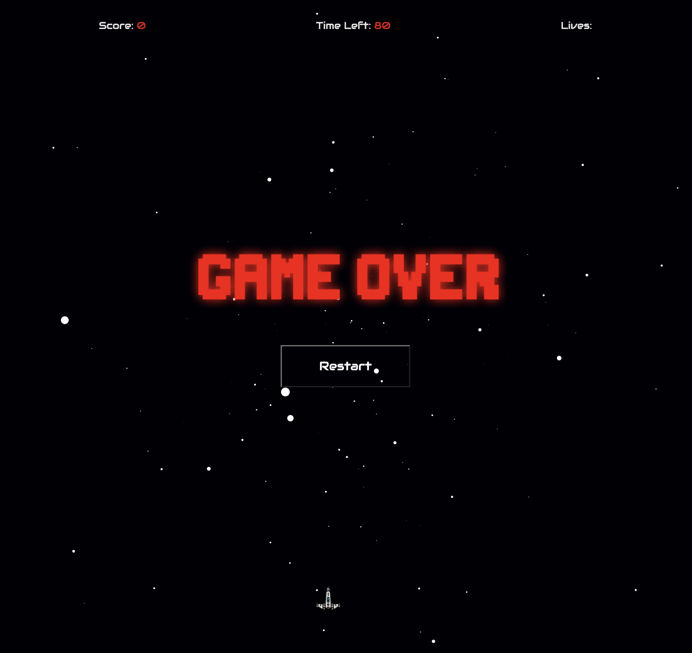
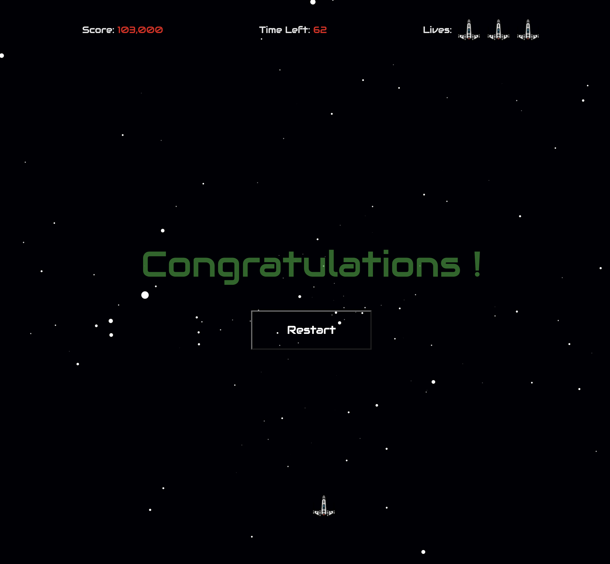

# General Assembly SEI-49 | Project 1: X-Wings Invaders

---
## Technical brief

* **7 Days to render the game in the browser**
* **Design logic for winning** & **visually display which player won**
* **Include separate HTML / CSS / JavaScript files**
* Stick with **KISS (Keep It Simple Stupid)** and **DRY (Don't Repeat Yourself)** principles
* **Use Javascript for DOM manipulation**
* HTML Canvas is **not** to be used during this project.
* **Deploy your game online**, where the rest of the world can access it
* Use **semantic markup** for HTML and CSS (adhere to best practices)

---
## Technologies:

 
Vanilla Javascript (ES6)
| CSS
| HTML5
 

---
## Overview

* The game is hosted [here](https://julienxemard.github.io/gameProject-1/)
* Else, kindly clone or fork the repository & open the index.html.

The list of games options were:
 
* Battleship
* Connect 4
* Frogger
* Mastermind
* Pac-man
* Snake
* Tetris
* Space Invaders
 

I chose Space Invaders as I wanted to create a different 2D | 3D immersive experience. 
My researches led me to find a .js script background that perfectly fitted both the brief & my idea. 
 

 
With a month of coding experience, Space Invaders game logic was a tough yet interesting challenge. 
The project allowed me to re-use all methods taught during our first month which also led me to realise the following statement: 
 

* It is one thing to understand it when an experienced programmer demonstrate & another to do it on your own. 
 
I realised that the frustration moments are the constant & that the solutions to them are intellectually rewarding. 

---
## Game Instructions

**Player Controls**
* Use **A** to move **⬅** & **D** to move **➡** 
* Use **W** to move **⬆** & **S** to move **⬇** 
* Use **Space Bar** to kill them all 👽! 
 

**Game Over Cases**
* If the enemy spaceships collide with yours 
* If some enemy spaceships reach the surface 
* If enemy lasers hit you 3 times 
 

**Game Win Case**
* If you eliminate all enemies within the given period 
 

Each scenarios will offer a restart option.

---
## Challenges

* The first difficulty was to figure out a way to initiate a movement pattern for each enemy. 
* Some difficulties applying the loop to have all enemies shooting randomly as a lot of intervals are involved.
* The restart function could have been simplified if I would have better planned this project.

## Comments

**Any suggestions to improve my code will be studied meticulously**

---
## Used Resources

* **Thank you, to Charlotte Morgan for her guidance ; she transformed difficult moments into fun ones**
* **Starfield background created in 2004 by Kurt Grigg.** |
[Stack Overflow](https://stackoverflow.com/questions/31680639/non-canvas-javascript-starfield-animation-in-latest-explorer-not-smooth)

---
